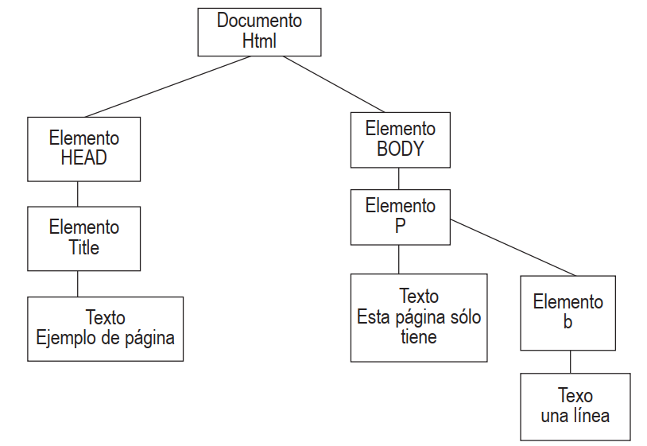

# ¿QUÉ ES DOM?
Cada vez que se carga una página el navegador genera de forma automática una estructura que contiene todos y cada
uno de los elementos de esa página. A través de mandatos de JavaScript, y otros lenguajes, podemos manipular de forma
dinámica estos elementos. El encargado de esto es el llamado DOM.
DOM significa Document Objet Model, y viene a traducirse más o menos como: modelo del objeto documento. Se trata
de una de las de las características con mayor influencia en el diseño dinámico de páginas web ya que permite manejar de
forma sencilla las páginas. 
DOM transforma una página en una estructura. Dicha estructura tiene forma de arbol y esta compuesta por **nodos**, de hecho a los nodos que dependen de otros se les suele llamar **nodos hijos** y al superior, **nodo padre**
#### Supongamos una página muy sencilla como la siguiente:
```html
<html>
  <head>
    <title>Ejemplo de página</title>
  </head>
  <body>
    <p>Esta página sólo tiene <b>una línea</b></p>
  </body>
</html>
```

#### Se transformará en el siguiente árbol:


Este es un ejemplo muy sencillo. Como podemos imaginar, lo habitual en una página cualquiera por la que naveguemos
es que tenga muchísimos nodos, cientos de ellos.

### Tipos de nodos
Si bien existen hasta 12 tipos de nodos, para manipular mediante DOM nuestras páginas nos basta con los que
detallamos a continuación:

- **Documento**: es el principal, de él partirán todos los demás nodos que componen nuestra página. También le podemos llamar nodo raíz.
- **Elemento**: existirá uno por cada una de las etiquetas de HTML. De él pueden derivarse otros nodos.
- **Atributo**: representa los atributos de HTML.
- **Texto**: representa el texto de la página.

### EL ACCESO A LOS NODOS
A partir del árbol generado por DOM podemos comenzar a acceder directamente a cada uno de sus nodos y
manipularlos para hacer cambios en nuestra página de forma dinámica. Por ejemplo, podríamos querer añadir a nuestro
árbol nuevos elementos.
#### Cada uno de los nodos puede ser accedido de dos formas:
- A través del nodo padre: desde el nodo raíz, indicando toda la sucesión de nodos dependientes de él hasta llegar
al nodo en particular
- Mediante acceso directo: que como es de suponer resulta más sencillo y por lo tanto será del que nos ocupemos
en este manual.
- Las funciones más utilizadas para acceso directo a los nodos son:
- **ElementsByTagName()**: se obtiene un array con todos los nodos con una etiqueta HTML determinada de la página.
Por ejemplo: misParrafos=document.getElementsByTagName(“p”); nos daría todas las etiquetas <p>, es decir
todos los párrafos de nuestra página.
Por supuesto podemos acceder a los elementos de dicho array como a los de cualquier otro: misParrafos[3] se
refiere al párrafo 4 (recordemos que el primer elemento de un array es el 0).
- **getElementsByName()**: en este caso se busca el nodo cuyo atributo name (de HTML) sea igual al mencionado. Lo
habitual es que sólo exista un elemento en la misma página con ese nombre, por lo que no suele dar problemas
- **getElementById()**: La función getElementById() es la más utilizada cuando se desarrollan aplicaciones web dinámicas. Se trata de la función preferida para acceder directamente a un nodo y poder leer o modificar sus propiedades.
- **querySelectorAll()** Sin duda el método más versátil, elem.querySelectorAll(css) devuelve todos los elementos dentro de elem que coinciden con el selector CSS dado.
-  **querySelector()**: La llamada a elem.querySelector(css) devuelve el primer elemento para el selector CSS dado.
En otras palabras, el resultado es el mismo que elem.querySelectorAll(css)[0], pero este último busca todos los elementos y elige uno, mientras que elem.querySelector sólo busca uno. Así que es más rápido y también más corto de escribir.

#### Resumen
Hay 6 métodos principales para buscar nodos en el DOM:
- querySelector	
- querySelectorAll	
- getElementById	
- getElementsByName
- getElementsByTagName
- getElementsByClassName

