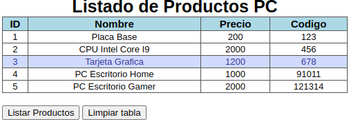

# Desafio #01

## Objetivo:
	Crear una página web que muestre los datos de un producto en forma de tabla
	
## Contenido:
	document.createElement
	document.querySelector
	elemento.appendChild
	addEventListener
	forEach
	innerHTML

### Practica:
	En un archivo main.js, crear un arreglo de objetos con las siguientes propiedades:
	-id
	-nombre
	-precio
	-codigo. 

	-Cargar al menos 5 productos para que funcione como una base de datos en memoria.
	-Crear un archivo index.html que contenga una tabla con los atributos del objeto creado.
	-Mostrar el contenido del arreglo de objetos en la tabla.
	-Crear un archivo style.css para dar formato a la pagina.
	-Establecer un formato similar a la figura
	
	
